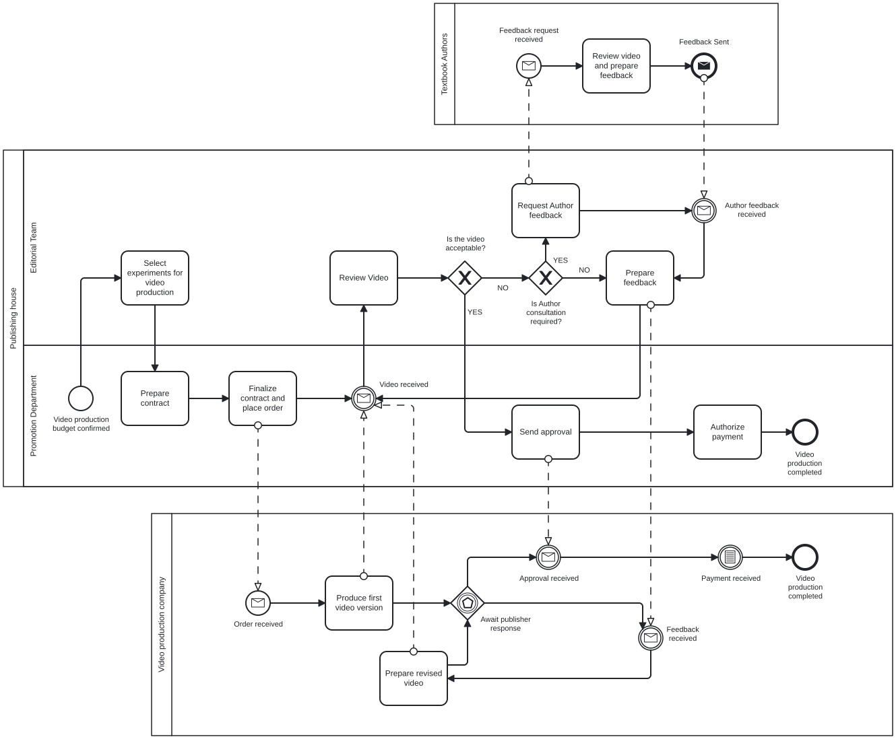
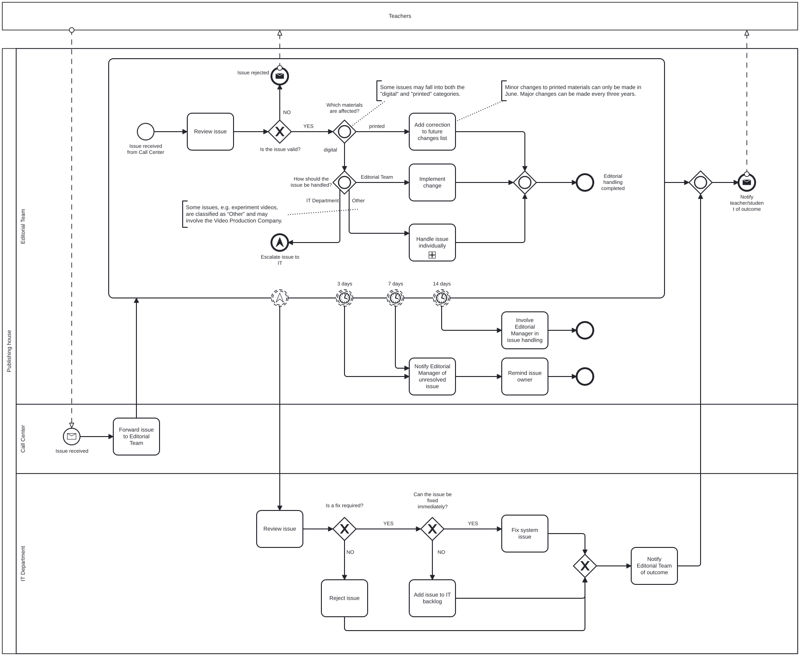

# Additional Editorial Process Models

This section contains additional BPMN 2.0 process models based on editorial and publishing workflows. They are included to demonstrate process modelling across different scenarios beyond the main case study.

## 1. Video production process

This BPMN diagram presents the process of producing videos that illustrate selected experiments from a physics textbook. Only selected experiments are commissioned for video production, with the work carried out by an external Production Company. The publisher reviews each version and may request revisions or consult the textbook authors before approval. The Promotion Department is responsible for contracting the supplier and authorising payment once the final version is accepted.

[View video_production_process source file](./process_diagram/video_production_process.bpmn)

## 2. Issue handling process

This BPMN diagram presents the process of handling issues reported by teachers concerning printed and digital educational materials. The Editorial Team reviews each issue and determines whether it should be handled internally, forwarded to the IT Department, or follow another resolution path. Some issues may require involvement from both Editorial and IT. The process also includes escalation rules for editorial cases that remain unresolved after 3, 7, or 14 days.

[View issue_handling source file](./process_diagram/issue_handling.bpmn)
