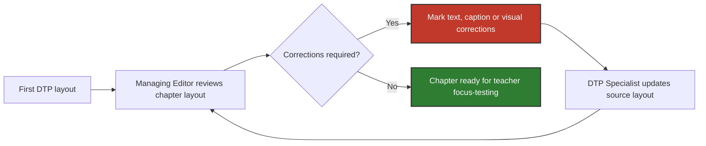

# 1. Problem & Scenario: Editorial–DTP Revision Workflow

## 1.1. AS-IS Problem

Once a manuscript was typeset for the first time, it entered an iterative revision loop between the **Managing Editor** and the **DTP Specialist**.

> [!WARNING]
> In the process this case study is based on, the workflow was primarily **paper-based**. DTP produced a printed proof, the Managing Editor reviewed the layout and marked corrections by hand, and the marked-up pages were returned to DTP for another revision.

This created several recurring problems:

| Pain point | Operational impact |
|---|---|
| 🔍 **No live text fit-check** | Even a small text correction requires DTP to update the layout before the Managing Editor can verify whether it works |
| 🖨️ **Paper-based page review** | Reviewing text and visual composition requires repeated printing and physical handoffs |
| 📄 **Corrections recorded across successive proofs** | Required changes are difficult to manage as one coherent set of issues |
| ❓ **No consolidated view of outstanding corrections** | The Managing Editor must manually determine which corrections have been completed and which still require attention |

These pain points provide the basis for the functional requirements defined in [`02_requirements.md`](./02_requirements.md).

---

## 1.2. Illustrative Scenario: Chapter 8

> The sequence below illustrates a typical revision path rather than a fixed number of rounds. Text, caption and visual issues could overlap and reappear across multiple iterations.

| Step | What happens |
|---|---|
| **1. Process input & first DTP layout** | DTP prepares the first typeset version of the chapter from the finalised manuscript. |
| **2. Initial layout review** | The Managing Editor reviews the typeset chapter in its actual page layout — checking whether text fits the available space and flows correctly around visual elements — marks required corrections on the printed proof, and returns it to DTP. | 
| **3. Visual assets & captions review** | Photographs, illustrations and captions are reviewed within the surrounding layout — checking technical fit as well as visual coherence (e.g. positioning, colour clashes, caption length) — with corrections marked and returned to DTP the same way. | 
| **4. Further revision cycles** | DTP applies the requested changes and produces an updated layout. The Managing Editor reviews it again; new issues may surface as other elements shift, so the cycle repeats until the chapter is ready. | 
| **5. Teacher-focus testing readiness** | The Managing Editor confirms the chapter is polished enough for teacher focus-testing — not final approval, as further changes may follow from feedback. | 

