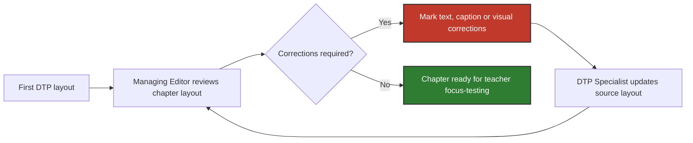

# Problem & Scenario: Editorial–DTP Revision Workflow

## 1. AS-IS Problem

Once a manuscript was typeset for the first time, it entered an iterative revision loop between the **Managing Editor** and the **DTP Specialist**.

> [!WARNING]
> In the process this case study is based on, the workflow was primarily **paper-based**. DTP produced a printed proof, the Managing Editor reviewed the layout and marked corrections by hand, and the marked-up pages were returned to DTP for another revision.

This created several recurring problems:

- 🔍 **No live way to check text fit.** The Managing Editor could not verify whether shortened or rewritten text would fit the available space until DTP updated the layout.
- 🖨️ **Page composition had to be reviewed on printed proofs.** Text, photographs, illustrations and captions needed to be assessed together within the actual page layout.
- 📄 **Corrections were recorded mainly on paper.** Required changes were distributed across successive marked-up proofs rather than stored in a shared digital view.
- ❓ **Outstanding corrections were difficult to track.** The Managing Editor had to manually verify which issues had already been addressed and which still required attention.

The scenario below illustrates how these problems appeared during the preparation of one textbook chapter for teacher focus-testing.

---

## 2. Illustrative Scenario: Chapter 8

> [!NOTE]
> The sequence below illustrates a typical revision path rather than a fixed number of rounds. Text, caption and visual issues could overlap and reappear across multiple iterations.

| Step | What happens | Actors |
|---|---|---|
| **1. Process input & first DTP layout** | DTP receives the finalized Chapter 8 manuscript after external subject-matter consultation and preliminary editing by the Managing Editor. The input also includes information about the planned placement of photographs and illustrations. The DTP Specialist prepares the first typeset version using the textbook's standard page layout. | Managing Editor, DTP Specialist |
| **2. Initial layout review** | The Managing Editor reviews the typeset chapter in its actual page layout. Issues that were difficult to predict from the source manuscript may become visible at this stage: body text or captions may not fit the available space, headings may require shortening, and text flow may need adjustment after visual elements are placed. Required corrections are marked directly on the printed proof and returned to the DTP Specialist. | Managing Editor, DTP Specialist |
| **3. Visual assets & captions review** | Photographs, illustrations and captions are reviewed together with the surrounding text. The Managing Editor evaluates not only whether these elements fit technically, but also how they work together visually. For example, an image may require repositioning, its colours may conflict with other elements on the page, or a caption may need shortening. These corrections are also marked on the printed proof and passed back to DTP. | Managing Editor, DTP Specialist |
| **4. Further revision cycles** | The DTP Specialist applies the requested changes to the source layout and prepares an updated version. The Managing Editor reviews the revised layout again. Previously identified issues may require further adjustment, while changes to one element may introduce new text or layout problems elsewhere. The review-and-correction cycle continues until the chapter is considered ready for the next stage. | Managing Editor, DTP Specialist |
| **5. Teacher-focus testing readiness** | The Managing Editor confirms that the chapter is sufficiently complete and visually polished to be presented during teacher focus-testing. This is not final publication approval: further changes may still result from focus-group feedback and later stages of the publishing process. | Managing Editor |

> [!CAUTION]
> This is **not** final publication approval. Further changes may still result from teacher focus-testing feedback and later stages of the publishing process.

---

## 3. Pain Points Summary

| Pain point | Operational impact |
|---|---|
| 🔍 **No live text fit-check** | Even a small text correction requires DTP to update the layout before the Managing Editor can verify whether it works |
| 🖨️ **Paper-based page review** | Reviewing text and visual composition requires repeated printing and physical handoffs |
| 📄 **Corrections recorded across successive proofs** | Required changes are difficult to manage as one coherent set of issues |
| ❓ **No consolidated view of outstanding corrections** | The Managing Editor must manually determine which corrections have been completed and which still require attention |

These pain points provide the basis for the functional requirements defined in [`02_requirements.md`](./02_requirements.md).
