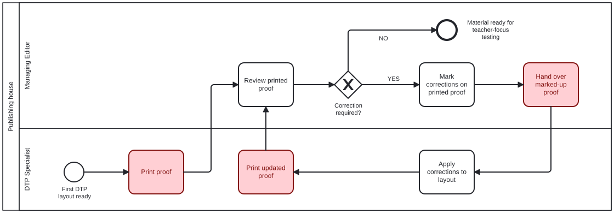
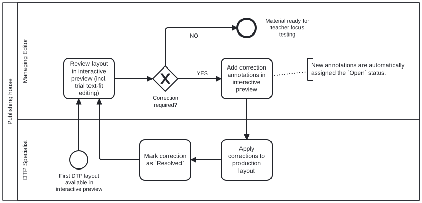

# 3. Process Diagrams

This document compares the current AS-IS chapter revision workflow with the proposed TO-BE process supported by a shared interactive layout preview.

The overall revision cycle remains unchanged: the Managing Editor reviews the layout, required corrections are applied by the DTP Specialist, and the updated version is reviewed again until the material is ready for teacher focus-testing. The proposed solution changes how corrections are communicated, tracked and verified.

---

## 3.1. AS-IS Process

The AS-IS model shows the current paper-based revision workflow. Printed proofs are used to review the layout, corrections are marked and numbered manually, and the marked-up proof is physically handed over to the DTP Specialist.

>**Legend:** Highlighted activities are eliminated in the proposed TO-BE process. Other activities may remain but be performed digitally.

[View AS-IS BPMN source file](../process_diagram/BPMN_AS-IS_editorial.bpmn)

---

## 3.2. TO-BE Process

The TO-BE model preserves the existing revision loop while replacing printed proofs and physical handoffs with a shared interactive layout preview.

Required corrections are recorded directly in the preview and are available to the DTP Specialist. New correction annotations are automatically assigned the `Open` status. After applying the requested correction to the production layout, the DTP Specialist marks the correction as `Resolved`. A resolved correction may be reopened if further changes are required during the next review.

[View TO-BE BPMN source file](../process_diagram/BPMN_TO-BE_editorial.bpmn)

---

## 3.3. AS-IS vs TO-BE — Key Process Changes

| AS-IS Limitation | TO-BE Change |
|---|---|
| Printed proofs are required for each review cycle. | The Managing Editor reviews the current layout directly in the shared interactive preview. |
| Corrections are manually marked on printed proofs. | Corrections are recorded as location-specific annotations and tracked digitally. |
| Marked-up proofs must be physically handed over to the DTP Specialist. | Recorded corrections are available to the DTP Specialist in the shared system. |
| Updated layouts must be printed again before the Managing Editor can verify the changes. | Updated layouts can be reviewed directly in the interactive preview. |
| Outstanding corrections must be identified by comparing successive printed proofs. | Corrections are tracked using `Open` and `Resolved` statuses and can be reviewed in a consolidated correction list. |
| Testing whether revised text fits the available layout space requires another DTP iteration. | The Managing Editor can trial-edit text in the preview to verify text fit before requesting a change to the production file. |

---

## 3.4. Expected Impact

The proposed TO-BE process is intended to:

- reduce printing and physical handoffs during revision cycles,
- make outstanding corrections easier to identify and track,
- reduce unnecessary DTP iterations caused by text-fit issues,
- provide both roles with a shared view of the current layout and correction status,
- shorten the overall chapter revision cycle while preserving DTP ownership of the production source file.
